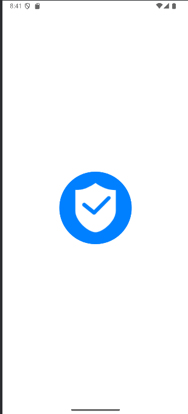
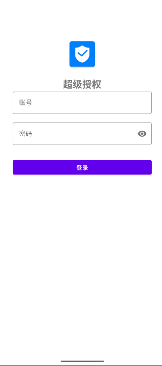
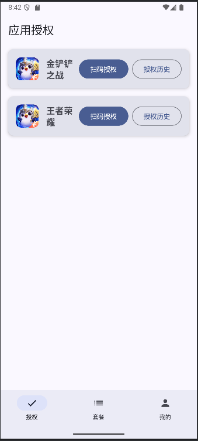
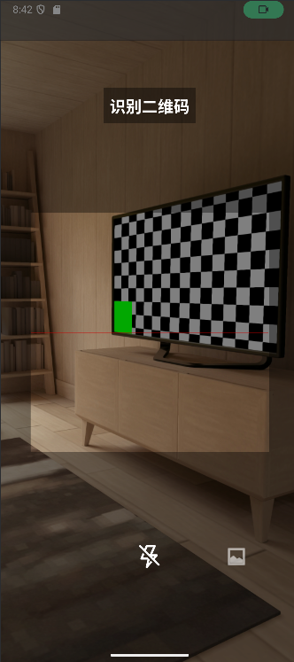
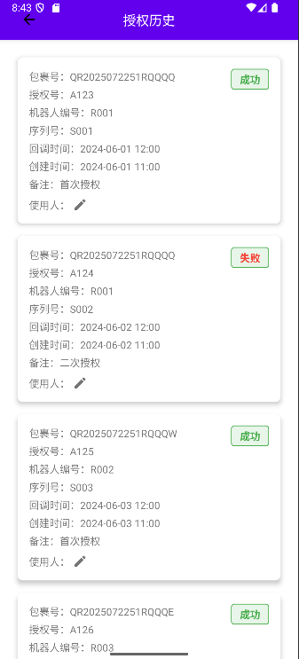
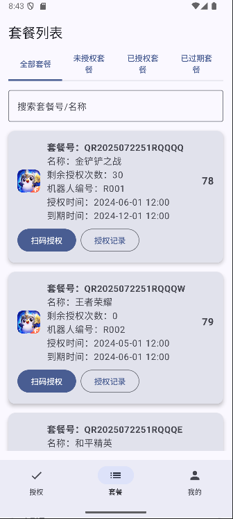
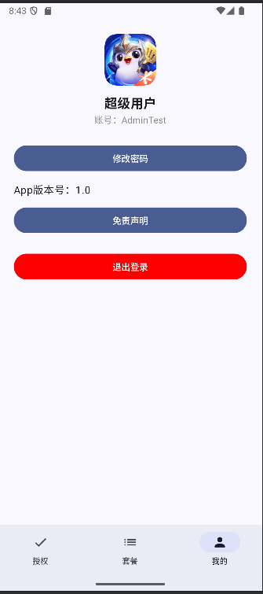

# 超级授权 微信扫码授权 扫码授权 游戏上号器

## 项目简介
超级授权是一个基于Android平台的移动应用，用于管理授权和套餐信息。系统采用现代化的UI设计，提供直观的用户界面和流畅的操作体验。
目前数据均为模拟数据 
## 技术架构
- 开发语言：Kotlin
- UI框架：Jetpack Compose + Material Design 3
- 架构模式：MVVM
- 依赖注入：Hilt
- 异步处理：Kotlin Coroutines + Flow
- 本地存储：Room Database
- 网络请求：Retrofit + OkHttp 
- 图片处理：Glide
- 二维码扫描：ZXing

## 主要功能

### 1. 用户认证
- 登录功能
  - 用户名/密码登录
  - 记住密码选项
  - 登录状态保持

### 2. 应用授权管理
- 扫码授权
  - 支持扫描二维码进行授权
  - 实时显示授权状态
  - 授权结果即时反馈

- 授权历史记录
  - 查看历史授权记录
  - 显示授权详细信息
    - 包裹号
    - 授权号
    - 机器人编号
    - 序列号
    - 回调时间
    - 创建时间
    - 备注信息
    - 授权状态（成功/失败）
  - 使用人管理
    - 显示使用人信息
    - 支持编辑使用人
    - 实时更新使用人信息

### 3. 套餐管理
- 套餐列表
  - 显示所有可用套餐
  - 套餐详细信息展示
    - 套餐名称
    - 套餐描述
    - 价格信息
    - 有效期

- 套餐授权记录
  - 查看套餐相关的授权记录
  - 授权状态追踪
  - 使用情况统计

## 界面设计
- 采用Material Design 3设计规范
- 响应式布局，适配不同屏幕尺寸
- 状态标签使用醒目的颜色和背景
- 卡片式布局，信息层次清晰
- 编辑功能采用对话框形式，操作便捷

## 数据模型

### AuthRecord（授权记录）
```kotlin
data class AuthRecord(
    val id: String,              // 记录ID
    val packageNo: String,       // 包裹号
    val authNo: String,          // 授权号
    val robotNo: String,         // 机器人编号
    val serialNo: String,        // 序列号
    val callbackTime: String,    // 回调时间
    val createTime: String,      // 创建时间
    val remark: String,          // 备注
    val status: Boolean,         // 授权状态
    var userName: String = ""    // 使用人
)
```

## 使用说明

### 授权管理
1. 点击"扫码授权"按钮
2. 使用相机扫描授权二维码
3. 等待授权结果反馈
4. 查看授权历史记录
5. 点击使用人信息或编辑图标可修改使用人

### 套餐管理
1. 在套餐列表中选择目标套餐
2. 查看套餐详细信息
3. 查看套餐相关的授权记录
4. 管理套餐使用情况

## 开发环境要求
- Android Studio Ladybug Feature Drop | 2024.2.2
- Kotlin 1.8.0
- Android SDK 34
- Gradle 8.2
- JDK 17

## 项目结构
```
app/
├── src/
│   ├── main/
│   │   ├── java/com/tian/app/ai/
│   │   │   ├── ui/
│   │   │   │   ├── authorization/    # 授权相关界面
│   │   │   │   ├── package/         # 套餐相关界面
│   │   │   │   └── login/          # 登录界面
│   │   │   ├── data/               # 数据层
│   │   │   ├── domain/             # 领域层
│   │   │   └── di/                 # 依赖注入
│   │   └── res/                    # 资源文件
│   └── test/                       # 测试代码
└── build.gradle                    # 项目配置
```

## 后续优化计划
1. 添加数据持久化存储
2. 实现离线模式
3. 优化图片加载性能
4. 添加数据统计功能
5. 实现批量授权功能
6. 添加用户权限管理
7. 优化UI动画效果
8. 添加深色模式支持

## 贡献指南
欢迎提交Issue和Pull Request来帮助改进项目。

## 版权信息
Copyright © 2025 Tian. All rights reserved.

## 致谢

zxing[https://github.com/zxing/zxing]


## 应用截图







